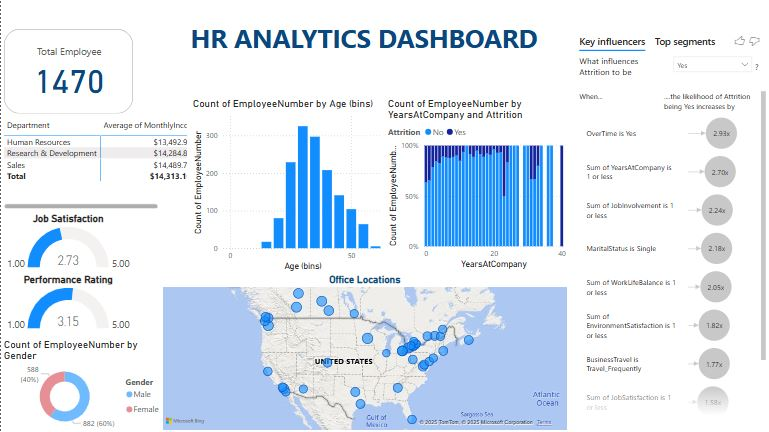

# 📊 HR Analytics Dashboard 

## 📝 Project Overview
This Power BI dashboard comprehensively analyzes employee data across departments and HR metrics. It helps HR teams make data-driven decisions by visualizing job satisfaction, performance ratings, gender ratio, attrition trends, etc. The dashboard also uses AI-powered key influencers to highlight the factors that impact employee attrition.

---

## 💡 Key Insights
- 📉 **Attrition Analysis**: Key influencers reveal how job satisfaction, overtime, environment, marital status, and work-life balance affect attrition.
- 🏢 **Department Breakdown**: View total and average number of employees per department.
- 🍩 **Donut Charts**: Visualize job satisfaction and performance ratings.
- 👨‍👩‍👧‍👦 **Gender Distribution**: See the male vs. female ratio in a simple pie chart.
- 📍 **Location Map**: Interactive map shows company office locations.
- 📊 **Demographic Insights**: Charts for age group distribution and years at company.

---

## 🛠 Tools & Techniques Used
- Power BI
- Power Query (Data Cleaning)
- Donut, Pie, Bar & Map Charts
- Key Influencers Visual
- Custom Tooltips & Filters
- Data Modeling

---

## 📷 Dashboard Preview

---

## 📁 Files Included
- `HR Analytics Dashboard.pbix` – Main Power BI dashboard file
- `HRM database.csv, GEO DATA.csv`  – Cleaned dataset used in the report
- `README.md` – Project documentation

---

## 📌 How to Use
1. Open the `.pbix` file using **Power BI Desktop**.
2. Explore filters to view insights by department, gender, and satisfaction levels.
3. Use key influencers to discover what factors contribute to employee attrition.
4. Analyze age, tenure, job involvement, and office location data to get deeper insights.
5. For previewing the dashboard, review this video: [Youtube Video](https://youtu.be/bB53hDMvaUE).

---

## 🧠 Extra Features
- 🔍 **AI-Driven Key Influencers** for attrition analysis
- 🎯 **Custom Interactivity** through slicers and tooltips
- 📎 **Data Relationships** built for efficient filtering and drill-downs

---

## 📬 Contact
Feel free to connect with me on [LinkedIn](https://www.linkedin.com/in/maheen-khalid-38a0591b0/).
